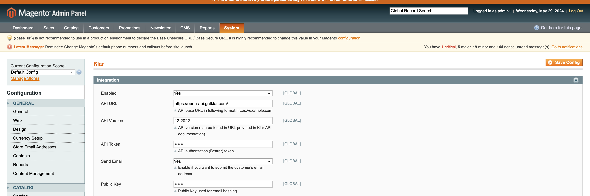
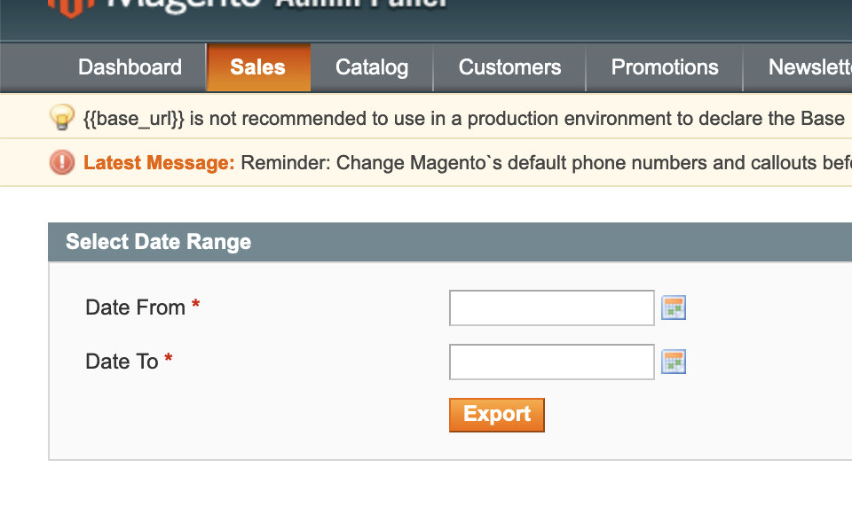
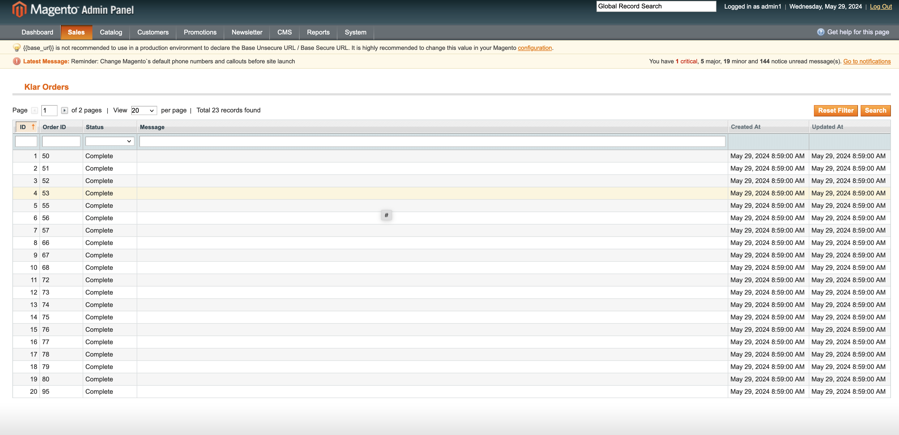
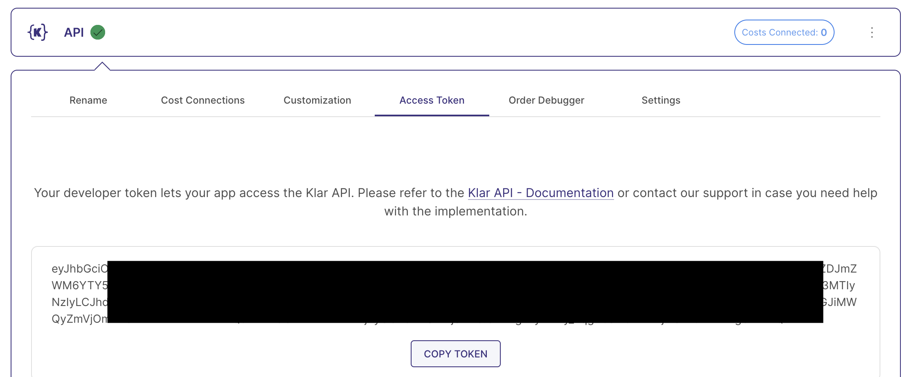

# Magento 1 Klar Integration Module

## Overview

The Magento 1 Klar integration module is designed to streamline the process of integrating your Magento 1 store into the Klar
business intelligence platform. With this module, you can easily connect your store to Klar
and centralize your data from a variety of sources, including your eCommerce platform, analytics and
advertising channels. Once your data is centralized, you can use Klar's powerful reporting and analytics tools to gain
deep insights into your store's performance, from customer behavior and sales trends to advertising ROI and much more.

## Compatibility

This module has been developed and tested on Magento 1.9.1. It may work with other versions of Magento 1
and PHP, but we cannot guarantee compatibility. If you encounter any issues with compatibility, please let us know by
creating an issue on GitHub. 

## Installation

To install the module, follow these steps:

1. Download the latest release here and unzip the file

2. Move the content of the folder Klar_DataSync to the following folder: magento_root/app/code/local

3. After a reload (log-in and out again) the module should be available in Magento

4. You can configure the module by going to admin -> system -> configration -> Klar -> DataSync.



5. As for the workflow, the orders are exported in 2 ways, automatically after placing order and manually via admin -> sales -> klar -> Schedule Export (you can select the date range). Both methods are handled by cron, so be sure to tell the client that the cron has to be configured and enabled. The status of orders can be checked in admin -> sales -> klar -> Orders Status. Here you can check the status, and if some error occured, the error message.

__

The status of the exported orders can be found here: 

__

#### API URL

For live:

```
   https://open-api.getklar.com
```

#### API Version

```
   12.2022
```

#### API Token

The token can be found in Klar in the **Klar Api** data source created for this shop.



#### Send Email

Configure whether you want to send the customer's email along with the order info to Klar. Otherwise the hashed email address will be submitted.

#### Public Key

The Public Key used to hash the customer's email address. Please contact Klar's support to receive your public key.

## Support

If you encounter any issues with the Magento 1 Klar integration module, please report them in the GitHub repository or
contact the module developer for support.

## License

The Magento 1 Klar integration module is licensed under the GNU General Public License v3.0.
